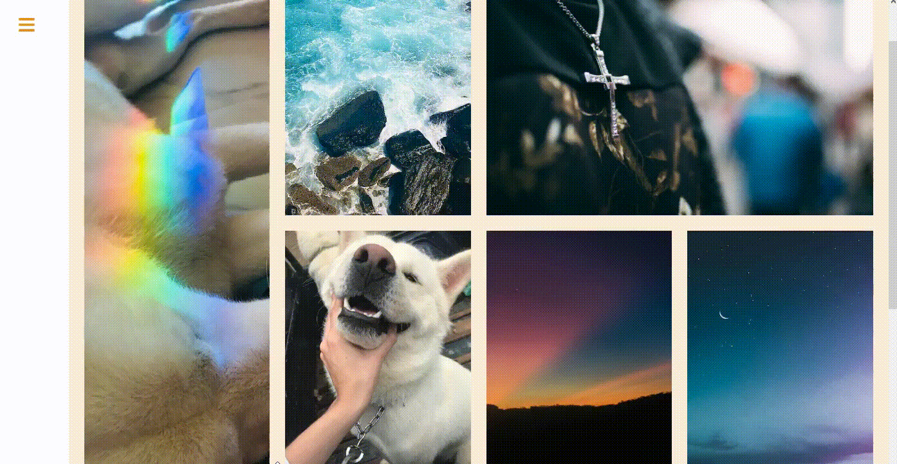
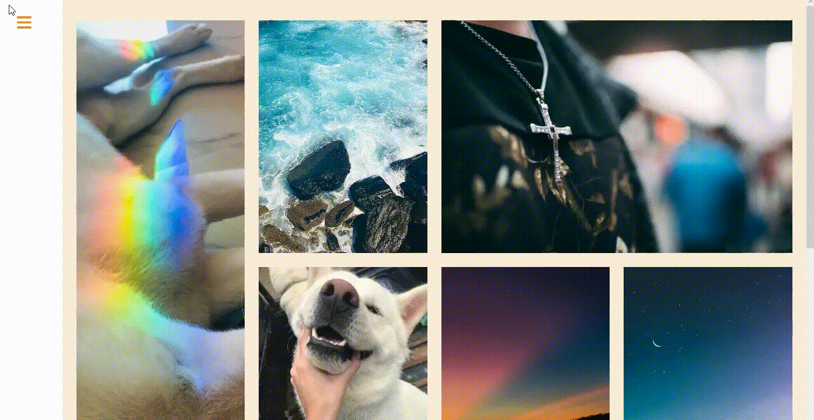

# Portfolio de Fotografia

## estudo de caso:
- [Portfolio](https://antoniomarcelino.github.io/portfolio-fotografia)

## linguagens:
- HTML
- CSS
- JavaScript

## recursos:
- galeria de imagens responsiva utilizando gridlayout:

- menu lateral com imagem:

